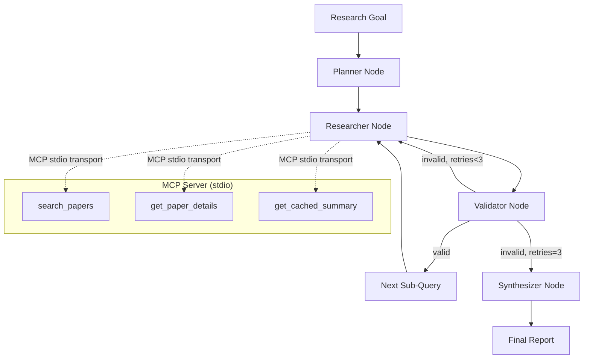

# MCP Research Agent System

[](https://github.com/hemanth2k6/mcp-research-agent-system/actions/workflows/ci.yml)

A multi-agent research system that combines **Model Context Protocol (MCP)** servers with **LangGraph** state machines to automate literature reviews on arXiv. The system decomposes a research goal into sub-queries, searches papers via an MCP-wrapped arXiv API, validates findings through heuristic + LLM-judge review, and synthesizes a structured markdown report.

---

## Architecture Overview



### Data Flow

1. **Planner** — Decomposes the high-level research goal into 3–5 focused sub-queries using an LLM with structured output (`PlannerDecomposition`).
2. **Researcher** — For each sub-query, spawns a **fresh MCP subprocess** (stdio transport) that wraps the arXiv API. Calls `search_papers` and `get_cached_summary` tools, returning `ResearchResult` objects.
3. **Validator** — Heuristic-first validation (zero papers, obvious off-topic) → if ambiguous, falls back to **LLM-judge** with structured output (`ValidationOutcome`). On invalid: revises the sub-query, increments attempt counter, loops back to Researcher (max 3 attempts). On valid: advances to next sub-query or Synthesizer.
4. **Synthesizer** — Aggregates all `validated_findings` into a structured markdown report via `SynthesizedReport` schema (Overview, Key Themes, Notable Papers, Gaps/Open Questions).

---

## Engineering Decisions & Trade-offs

| Decision | Rationale | Trade-off |
|----------|-----------|-----------|
| **Fresh MCP subprocess per sub-query** | Guarantees isolation; no cross-query state leakage; matches MCP's designed stateless per-session model. | Higher latency (~100–300ms subprocess spawn) vs. persistent server. Mitigated by SQLite caching. |
| **Heuristic-first validation + LLM-judge fallback** | Avoids LLM cost/latency for obvious failures (empty results, clear off-topic). LLM only invoked on ambiguous cases. | Heuristics can be fooled by adversarial/edge cases; LLM judge adds a safety net. |
| **Retry loop with query revision (max 3)** | Self-correcting: validator suggests a refined query, researcher retries. Prevents dead ends from poor initial decomposition. | Increases total runtime (up to 3× researcher calls per sub-query). Bounded by `MAX_RESEARCHER_ATTEMPTS=3`. |
| **SQLite caching layer** | arXiv API has rate limits; repeated queries for same topic across retries/runs benefit from local cache. | Cache invalidation is manual (TTL-based); stale summaries possible if papers updated. |
| **Provider-agnostic LLM client (`get_llm`)** | Works with any OpenAI-compatible endpoint (OmniRoute, vLLM, OpenAI, Gemini, Ollama). Configured via `OPENAI_BASE_URL` + `OPENAI_API_KEY`. | Requires endpoint to support structured output (`with_structured_output`). |
| **Structured JSONL tracing** | Every node entry/exit, tool call, and error logged as JSONL to `logs/trace.jsonl`. Enables debugging, replay, and observability. | Log files grow unbounded; no built-in rotation (add logrotate or similar for production). |
| **Typed state via TypedDict** | LangGraph state is fully typed (`ResearchState`), catching key errors at mypy time. | Boilerplate for state updates; `create_initial_state` factory helps. |
| **Pydantic v2 for all schemas** | Runtime validation of LLM outputs, tool inputs, and MCP tool results. Fail-fast on schema violations. | Slight overhead vs. raw dicts; worth it for correctness. |

---

## Quick Start

### Prerequisites

- Python 3.11+
- An OpenAI-compatible LLM endpoint (OmniRoute, vLLM, OpenAI, etc.)
- (Optional) Docker for containerized deployment

### Installation

```bash
# Clone and install in development mode
git clone https://github.com/hemanth2k6/mcp-research-agent-system.git
cd mcp-research-agent-system
pip install -e ".[dev]"

# Configure LLM endpoint (any OpenAI-compatible API)
export OPENAI_BASE_URL="https://your-endpoint.example.com/v1"
export OPENAI_API_KEY="your-api-key"
export OPENAI_MODEL="gpt-4o-mini"  # or your model of choice
```

### Run a Research Query

```bash
# Basic usage
research-agent "quantum error correction surface codes"

# Verbose mode (streams node progress to stdout)
research-agent "transformer attention mechanisms" -v

# Save report to file
research-agent "graph neural networks for drug discovery" -o report.md
```

### Docker

```bash
# Build image
docker build -t mcp-research-agent .

# Run (pass env vars for LLM)
docker run --rm \
  -e OPENAI_BASE_URL \
  -e OPENAI_API_KEY \
  -e OPENAI_MODEL \
  mcp-research-agent "your research goal"
```

---

## Usage Examples

### Example 1: Basic Research Goal

```bash
$ research-agent "quantum error correction surface codes"
```

**Output** (truncated):
```
# Quantum Error Correction: Surface Codes and Beyond

## Overview
This report surveys recent advances in quantum error correction with a focus on surface codes...

## Key Themes
1. **Surface Code Thresholds** — Multiple papers establish error thresholds...
2. **Decoder Improvements** — Neural network and MWPM decoders...
3. **Hardware Implementations** — Superconducting qubits, trapped ions...

## Notable Papers
- **Surface Codes: Towards Practical Large-Scale Quantum Computation** (Fowler et al., 2012) — Foundational surface code architecture.
- **Recent Advances in Quantum Error Correction with Neutral Atoms** (2024) — Neutral atom platform implementations.

## Gaps / Open Questions
- Logical qubit scaling beyond 100 physical qubits
- Real-time decoder latency for fault-tolerant cycles
```

### Example 2: Verbose Trace (What You See in `logs/trace.jsonl`)

```json
{"timestamp": "2026-08-21T15:44:19.971522+00:00", "event_type": "synthesizer_input", "payload": {"research_goal": "quantum error correction", "findings_count": 1}}
{"timestamp": "2026-08-21T15:44:21.574371+00:00", "event_type": "researcher_tool_call", "payload": {"tool": "search_papers", "input": {"query": "surface codes", "max_results": 10}, "sub_query": "surface codes"}}
{"timestamp": "2026-08-21T15:44:22.930660+00:00", "event_type": "tool_result", "payload": {"tool_name": "search_papers", "output_summary": {"paper_count": 10}, "duration_ms": 1352.67}}
{"timestamp": "2026-08-21T15:44:22.937775+00:00", "event_type": "researcher_tool_call", "payload": {"tool": "get_cached_summary", "input": {"topic": "surface codes"}, "sub_query": "surface codes"}}
{"timestamp": "2026-08-21T15:44:22.943917+00:00", "event_type": "tool_result", "payload": {"tool_name": "get_cached_summary", "output_summary": {"match_count": 14}, "duration_ms": 4.30}}
{"timestamp": "2026-08-21T15:44:23.156663+00:00", "event_type": "synthesizer_input", "payload": {"research_goal": "quantum error correction", "findings_count": 10}}
{"timestamp": "2026-08-21T15:44:23.156982+00:00", "event_type": "synthesizer_output", "payload": {"report_length": 2847, "status": "success"}}
```

> **Note**: Each sub-query spawns a fresh MCP subprocess. The trace shows `researcher_tool_call` → `tool_call` → `tool_result` pairs for each MCP tool invocation.

### Example 3: Retry Loop in Action

When the researcher returns off-topic or empty results, the validator revises the query and retries (up to 3 times):

```bash
$ research-agent "impossible query xyz123" -v
```

**Verbose output**:
```
[planner] Decomposed into: ['impossible query xyz123']
[researcher] Searching: "impossible query xyz123" → 0 papers
[validator] Heuristic: zero papers → invalid, revised query: "impossible query xyz123 related research"
[researcher] Searching: "impossible query xyz123 related research" → 0 papers
[validator] Heuristic: zero papers → invalid, revised query: "broader topic impossible query"
[researcher] Searching: "broader topic impossible query" → 3 papers
[validator] Heuristic: relevant → valid
[synthesizer] Generating final report...
```

---

## Testing

The test suite (156 tests) is **fully offline** — no real network calls, arXiv API, or LLM endpoints are invoked. All external dependencies are mocked at the integration layer.

```bash
# Run full test suite
pytest -v

# Run with coverage
pytest --cov=src/mcp_research_agent_system --cov-report=term-missing

# Type-check
mypy src/mcp_research_agent_system tests

# Lint
ruff check src tests
```

### Key Test Modules

| Module | Focus |
|--------|-------|
| `test_validation.py` | **Retry-loop integration tests** — Forces researcher to return bad results twice, then good results on 3rd attempt; asserts graph retries correctly and attempts capped at 3. Also tests exhausted attempts path (max retries → synthesizer proceeds). |
| `test_graph.py` | Graph routing: planner → researcher → validator → synthesizer; error handling in each node; router exhaustion logic. |
| `test_cli.py` | CLI argument parsing, pipeline execution, error propagation, verbose streaming. |
| `test_arxiv_client.py` | Atom XML parsing, rate limiting, date filtering, error handling. |
| `test_cache.py` | SQLite cache operations, TTL expiry, concurrent access. |
| `test_mcp_server.py` | MCP tool registration, stdio transport, tool input validation. |
| `test_planner.py` | Sub-query decomposition, structured output validation. |
| `test_researcher.py` | Researcher sub-agent, MCP subprocess management, error handling. |
| `test_synthesizer.py` | Report synthesis, structured output, fallback handling. |

### Retry-Loop Integration Test (from `test_validation.py`)

```python
async def test_retry_loop_then_success(self):
    """Test graph retries with bad results, then succeeds."""
    # 1st call: empty result -> validator says invalid, retry
    # 2nd call: off-topic result -> validator says invalid, retry
    # 3rd call: good result -> validator says valid
    bad_empty = _make_research_result("quantum error correction", [])
    bad_offtopic = _make_research_result("quantum error correction", [off_topic_paper])
    good_result = _make_research_result("quantum error correction", [valid_paper])
    
    run_research_mock = AsyncMock(side_effect=[bad_empty, bad_offtopic, good_result])
    
    # ... run graph ...
    
    # Researcher called 3 times (initial + 2 retries before success on 3rd)
    assert run_research_mock.call_count == 3
    assert result["validation_status"] == "valid"
```

This test validates the **core self-correcting loop**: the system doesn't give up on the first failure — it revises the query and retries, with a hard cap to prevent infinite loops.

---

## Project Structure

```
mcp-research-agent-system/
├── .github/
│   └── workflows/
│       └── ci.yml                 # GitHub Actions CI (ruff, mypy, pytest)
├── docs/
│   └── graph_diagram.mmd          # Mermaid architecture diagram
├── logs/
│   └── trace.jsonl                # JSONL trace output (gitignored)
├── scripts/
│   └── view_trace.py              # CLI trace viewer
├── src/
│   └── mcp_research_agent_system/
│       ├── __init__.py
│       ├── agents/
│       │   ├── __init__.py
│       │   ├── graph.py           # LangGraph state machine (planner/researcher/validator/synthesizer)
│       │   ├── planner.py         # Goal decomposition + validation logic
│       │   ├── researcher.py      # MCP subprocess + arXiv search
│       │   ├── synthesizer.py     # Report synthesis
│       │   └── state.py           # TypedDict ResearchState + factory
│       ├── arxiv_client.py        # Async arXiv API client (Atom XML)
│       ├── cache.py               # SQLite caching layer
│       ├── cli.py                 # CLI entrypoint (research-agent)
│       ├── config.py              # Pydantic Settings (env vars)
│       ├── errors.py              # Custom exceptions
│       ├── logging_utils.py       # JSONL structured logging
│       ├── mcp_server.py          # MCP stdio server (search_papers, get_paper_details, get_cached_summary)
│       └── trace_viewer.py        # Trace log analysis utilities
├── tests/
│   ├── __init__.py
│   ├── conftest.py
│   ├── test_arxiv_client.py
│   ├── test_cache.py
│   ├── test_cli.py
│   ├── test_graph.py
│   ├── test_mcp_server.py
│   ├── test_planner.py
│   ├── test_researcher.py
│   ├── test_synthesizer.py
│   └── test_validation.py         # Retry-loop + LLM-judge tests
├── Dockerfile
├── LICENSE
├── pyproject.toml
└── README.md
```

---

## Configuration

All settings via environment variables (`.env` supported via `python-dotenv`):

| Variable | Required | Default | Description |
|----------|----------|---------|-------------|
| `OPENAI_BASE_URL` | Yes | — | OpenAI-compatible API base URL |
| `OPENAI_API_KEY` | Yes | — | API key for LLM endpoint |
| `OPENAI_MODEL` | No | `gpt-4o-mini` | Model name for all LLM calls |
| `ARXIV_RATE_LIMIT_DELAY` | No | `3.0` | Seconds between arXiv API requests |
| `CACHE_DB_PATH` | No | `cache.db` | SQLite database path |
| `LOG_DIR` | No | `logs` | Directory for JSONL traces |

---

## Contributing

1. Fork the repository
2. Create a feature branch (`git checkout -b feature/amazing-feature`)
3. Make changes with tests
4. Run `ruff check && mypy src tests && pytest` — all must pass
5. Open a Pull Request

---

## License

Distributed under the MIT License. See `LICENSE` for more information.