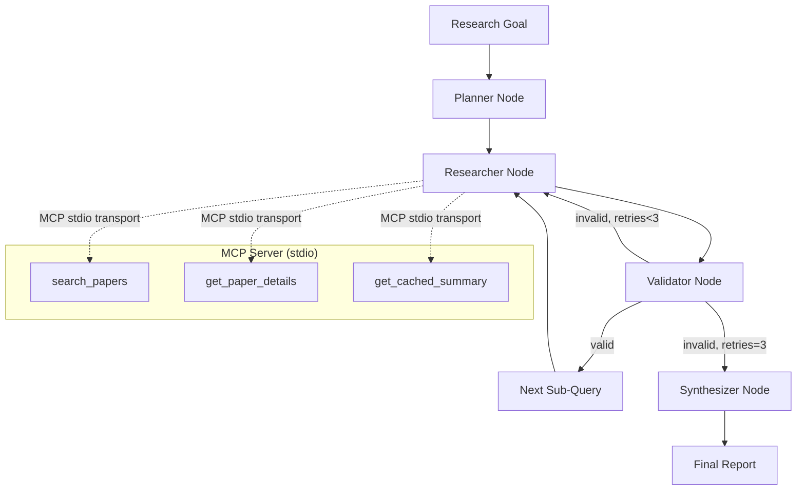

# MCP Research Agent System

[](https://github.com/hemanth2k6/mcp-research-agent-system/actions/workflows/ci.yml)

A multi-agent research system that combines **Model Context Protocol (MCP)** servers with **LangGraph** state machines to automate literature reviews on arXiv. The system decomposes a research goal into sub-queries, searches papers via an MCP-wrapped arXiv API, validates findings through heuristic + LLM-judge review, and synthesizes a structured markdown report.

---

## Architecture Overview



### Data Flow

1. **Planner** — Decomposes the high-level research goal into 3–5 focused sub-queries using an LLM with structured output (`PlannerDecomposition`).
2. **Researcher** — For each sub-query, spawns a **fresh MCP subprocess** (stdio transport) that wraps the arXiv API. Calls `search_papers` and `get_cached_summary` tools, returning `ResearchResult` objects.
3. **Validator** — Heuristic-first validation (zero papers, obvious off-topic) → if ambiguous, falls back to **LLM-judge** with structured output (`ValidationOutcome`). On invalid: revises the sub-query, increments attempt counter, loops back to Researcher (max 3 attempts). On valid: advances to next sub-query or Synthesizer.
4. **Synthesizer** — Aggregates all `validated_findings` into a structured markdown report via `SynthesizedReport` schema (Overview, Key Themes, Notable Papers, Gaps/Open Questions).

---

## Engineering Decisions & Trade-offs

| Decision | Rationale | Trade-off |
|----------|-----------|-----------|
| **Fresh MCP subprocess per sub-query** | Guarantees isolation; no cross-query state leakage; matches MCP's designed stateless per-session model. | Higher latency (~100–300ms subprocess spawn) vs. persistent server. Mitigated by SQLite caching. |
| **Heuristic-first validation + LLM-judge fallback** | Avoids LLM cost/latency for obvious failures (empty results, clear off-topic). LLM only invoked on ambiguous cases. | Heuristics can be fooled by adversarial/edge cases; LLM judge adds a safety net. |
| **Retry loop with query revision (max 3)** | Self-correcting: validator suggests a refined query, researcher retries. Prevents dead ends from poor initial decomposition. | Increases total runtime (up to 3× researcher calls per sub-query). Bounded by `MAX_RESEARCHER_ATTEMPTS=3`. |
| **SQLite caching layer** | arXiv API has rate limits; repeated queries for same topic across retries/runs benefit from local cache. | Cache invalidation is manual (TTL-based); stale summaries possible if papers updated. |
| **Provider-agnostic LLM client (`get_llm`)** | Works with any OpenAI-compatible endpoint (OmniRoute, vLLM, OpenAI, Gemini, Ollama). Configured via `LLM_BASE_URL` + `LLM_API_KEY` + `LLM_MODEL`. Tested default: Gemini (`https://generativelanguage.googleapis.com/v1beta/openai/`, `gemini-3.5-flash`). | Requires endpoint to support structured output (`with_structured_output`). |
| **Structured JSONL tracing** | Every node entry/exit, tool call, and error logged as JSONL to `logs/trace.jsonl`. Enables debugging, replay, and observability. | Log files grow unbounded; no built-in rotation (add logrotate or similar for production). |
| **Typed state via TypedDict** | LangGraph state is fully typed (`ResearchState`), catching key errors at mypy time. | Boilerplate for state updates; `create_initial_state` factory helps. |
| **Pydantic v2 for all schemas** | Runtime validation of LLM outputs, tool inputs, and MCP tool results. Fail-fast on schema violations. | Slight overhead vs. raw dicts; worth it for correctness. |

---

## Notable Bugs Found & Fixed

**Verbose-mode double-execution bug** (commit `91b14e1`): In verbose CLI mode (`-v`), the LangGraph stream (`astream` with `stream_mode="values"`) was followed by a redundant `ainvoke` call on the same compiled graph. This caused the entire pipeline to execute twice — doubling LLM API usage, arXiv queries, and trace log entries. The bug was diagnosed by examining `logs/trace.jsonl`, which showed the planner node re-entering and generating sub-queries a second time after the synthesizer had already completed. The fix captures the final state directly from the `stream_mode="values"` iterator (the last yielded state contains the complete result), eliminating the second invocation. A regression test in `tests/test_cli.py::test_verbose_mode_no_double_execution` now asserts that the researcher node is invoked exactly once per sub-query in verbose mode.

---

## Known Limitations

- **Free-tier LLM API constraints**: The default configuration uses Gemini's free tier (20 requests/day), which imposes a hard limit on how often the full pipeline can be run. The planner's fallback-parsing logic (structured output → manual JSON extraction → regex fallback) and the validator's heuristic-first design (zero-paper / off-topic checks before LLM-judge) were built partly to maximize success rate within this quota.
- **arXiv API rate limits**: The built-in 3-second delay between requests and SQLite caching mitigate this, but high-volume runs may still hit limits.
- **No log rotation**: JSONL trace files in `logs/` grow unbounded; production deployments should add logrotate or similar.
- **Single-provider structured output assumption**: The `get_llm` client assumes the endpoint supports `with_structured_output` (OpenAI-compatible function calling). Endpoints without this will fail at runtime.

---

## Quick Start

### Prerequisites

- Python 3.11+
- An OpenAI-compatible LLM endpoint (OmniRoute, vLLM, OpenAI, etc.)
- (Optional) Docker for containerized deployment

### Installation

```bash
# Clone and install in development mode
git clone https://github.com/hemanth2k6/mcp-research-agent-system.git
cd mcp-research-agent-system
pip install -e ".[dev]"

# Configure LLM endpoint (any OpenAI-compatible API)
# Tested default: Gemini
export LLM_BASE_URL="https://generativelanguage.googleapis.com/v1beta/openai/"
export LLM_API_KEY="your-gemini-api-key-here"
export LLM_MODEL="gemini-3.5-flash"  # or your model of choice
```

### Run a Research Query

```bash
# Basic usage
research-agent "quantum error correction surface codes"

# Verbose mode (streams node progress to stdout)
research-agent "transformer attention mechanisms" -v

# Save report to file
research-agent "graph neural networks for drug discovery" -o report.md
```

### Docker

```bash
# Build image
docker build -t mcp-research-agent .

# Run with docker run (pass env vars, or use .env file)
docker run --rm \
  --env-file .env \
  -v $(pwd)/data:/app/data \
  -v $(pwd)/logs:/app/logs \
  mcp-research-agent "your research goal"

# Verbose mode
docker run --rm \
  --env-file .env \
  -v $(pwd)/data:/app/data \
  -v $(pwd)/logs:/app/logs \
  mcp-research-agent "your research goal" --verbose

# Or with docker compose (loads .env automatically)
docker compose run --rm research-agent "your research goal"

# Verbose with docker compose
docker compose run --rm research-agent "your research goal" --verbose
```

---

## Usage Examples

### Example 1: Basic Research Goal (Verified Run)

```bash
$ research-agent "recent progress in mixture-of-experts model architectures"
```

**Output** (trimmed from verified run — August 2026):
```
Starting research pipeline for: recent progress in mixture-of-experts model architectures
Trace logs will be written to: logs

  ⟳ researcher: Query 1: ... (attempt 1, 0 papers)
  ✓ planner: Generated 4 sub-queries: mixture of experts routing mechanisms soft top-k expert choice, sparse mixture of experts load balancing training stability, sparse mixture of experts vision transformers multimodal architectures...
  ✓ planner: Generated 4 sub-queries: mixture of experts routing mechanisms soft top-k expert choice, sparse mixture of experts load balancing training stability, sparse mixture of experts vision transformers multimodal architectures...
  ✓ planner: Generated 4 sub-queries: mixture of experts routing mechanisms soft top-k expert choice, sparse mixture of experts load balancing training stability, sparse mixture of experts vision transformers multimodal architectures...
  ✓ planner: Generated 4 sub-queries: mixture of experts routing mechanisms soft top-k expert choice, sparse mixture of experts load balancing training stability, sparse mixture of experts vision transformers multimodal architectures...
  ✓ planner: Generated 4 sub-queries: mixture of experts routing mechanisms soft top-k expert choice, sparse mixture of experts load balancing training stability, sparse mixture of experts vision transformers multimodal architectures...
  ✓ planner: Generated 4 sub-queries: mixture of experts routing mechanisms soft top-k expert choice, sparse mixture of experts load balancing training stability, sparse mixture of experts vision transformers multimodal architectures...
  ✓ planner: Generated 4 sub-queries: mixture of experts routing mechanisms soft top-k expert choice, sparse mixture of experts load balancing training stability, sparse mixture of experts vision transformers multimodal architectures...
  ✓ planner: Generated 4 sub-queries: mixture of experts routing mechanisms soft top-k expert choice, sparse mixture of experts load balancing training stability, sparse mixture of experts vision transformers multimodal architectures...
  ✓ planner: Generated 4 sub-queries: mixture of experts routing mechanisms soft top-k expert choice, sparse mixture of experts load balancing training stability, sparse mixture of experts vision transformers multimodal architectures...
  ✓ planner: Generated 4 sub-queries: mixture of experts routing mechanisms soft top-k expert choice, sparse mixture of experts load balancing training stability, sparse mixture of experts vision transformers multimodal architectures...

============================================================
                                    Overview                                    

This research report synthesizes recent progress in Mixture-of-Experts (MoE)    
model architectures based on validated literature. The surveyed research focuses
on addressing the fundamental challenges of MoE models: routing instability,    
load imbalance, high parameter memory footprints, offloading latency during     
inference, and cross-domain generalization in vision, graph neural networks, and
recommendation systems.                                                         

                                   Key Themes                                   

1. Routing Mechanism Innovations & Load Balancing                               

Standard top-$k$ routing often suffers from expert under-utilization,           
non-differentiability, and routing collapse. Recent work introduces continuous  
or soft relaxations, inverse routing paradigms (expert choice),                 
similarity-preserving router formulations, and copula-based dependence modeling 
across tokens to maintain balanced expert load without performance degradation. 

2. Inference Efficiency, Offloading & Quantization                              

Deploying large MoE models on memory-constrained hardware requires efficient    
parameter management. Key strategies include predictive expert caching, token   
scheduling, dynamic expert quantization, expert pruning/skipping, and           
speculative decoding techniques designed to overlap dynamic CPU-to-GPU          
offloading latency with compute.                                                

3. Interpretability & Theoretical Foundations                                   

Understanding router behavior and training dynamics is essential for            
architectural optimization. Recent studies formulate mathematical bounds for    
softmax gating convergence, analyze auxiliary-loss-free load balancing          
procedures, and introduce routing signatures to trace task-conditioned expert   
activation patterns.                                                            

4. Cross-Domain MoE Applications                                                

Beyond text-based Large Language Models (LLMs), MoE principles are increasingly 
adapted to vision transformers, graph neural networks facing severe distribution
shifts, and real-time multimodal streaming recommender systems.                 

                                 Notable Papers                                 

 • Mixture-of-Experts with Expert Choice Routing (Yanqi Zhou et al.) — Inverts  
   token routing by allowing experts to select top-$k$ tokens, ensuring perfect 
   load balancing (arXiv:2202.09368v2).                                         
 • SoftMoE: Soft Differentiable Routing for Mixture-of-Experts in LLMs (Mikołaj 
   Zasada et al.) — Replaces discrete top-$k$ selection with a soft LapSum      
   relaxation for fully differentiable routing (arXiv:2606.17952v1).            
 • Task-Conditioned Routing Signatures in Sparse Mixture-of-Experts Transformers
   (Mynampati Sri Ranganadha Avinash) — Formulates routing signatures to study  
   task-conditioned structural patterns in sparse MoE models                    
   (arXiv:2603.11114v1).                                                        
 • A Theoretical Framework for Auxiliary-Loss-Free Load Balancing of Sparse     
   Mixture-of-Experts in Large-Scale AI Models (X. Y. Han, Yuan Zhong) —        
   Provides rigorous theoretical analysis of auxiliary-loss-free routing        
   mechanisms (arXiv:2512.03915v3).                                             
 • Load Balancing Mixture of Experts with Similarity Preserving Routers (Nabil  
   Omi et al.) — Develops routers that preserve input similarity to prevent load
   imbalance without auxiliary penalties (arXiv:2506.14038v2).                  
 • Hierarchical Copula-Gumbel-Top-K Routing (Richard Yi Da Xu) — Controls joint 
   routing dependencies across related tokens using exchangeable copula         
   structures (arXiv:2607.28670v3).                                             
 • ExpertFlow: Efficient Mixture-of-Experts Inference via Predictive Expert     
   Caching and Token Scheduling (Xin He et al.) — Enables single-GPU MoE serving
   through predictive caching and offloading (arXiv:2410.17954v2).              
 • Not All Experts are Equal: Efficient Expert Pruning and Skipping for         
   Mixture-of-Experts Large Language Models (Xudong Lu et al.) — Proposes       
   plug-and-play expert pruning and runtime skipping to shrink parameter        
   footprints (arXiv:2402.14800v2).                                             
 • Dynamic Expert Quantization for Scalable Mixture-of-Experts Inference (Kexin 
   Chu et al.) — Reduces runtime memory consumption using dynamic post-training 
   quantization on expert parameters (arXiv:2511.15015v3).                      
 • Accelerating Mixture-of-Experts Inference by Hiding Offloading Latency with  
   Speculative Decoding (Zhibin Wang et al.) — Introduces SpecMoEOff to hide    
   CPU-GPU expert transfer latency during inference (arXiv:2508.21706v2).       
 • MoE-SpeQ: Speculative Quantized Decoding with Proactive Expert Prefetching   
   and Offloading for Mixture-of-Experts (Wenfeng Wang et al.) — Combines       
   speculative quantized execution with proactive prefetching over PCIe         
   (arXiv:2511.14102v1).                                                        
 • QuantMoE-Bench: Examining Post-Training Quantization for Mixture-of-Experts  
   (Pingzhi Li et al.) — Benchmarks diverse post-training quantization schemes  
   across MoE architectures (arXiv:2406.08155v2).                               
 • Convergence Rates for Softmax Gating Mixture of Experts (Huy Nguyen et al.) —
   Establishes theoretical convergence guarantees for softmax gating routers    
   (arXiv:2503.03213v1).                                                        
 • Mixture-of-Experts Models in Vision: Routing, Optimization, and              
   Generalization (Adam Rokah et al.) — Evaluates dense, SoftMoE, and SparseMoE 
   heads on image classification tasks (arXiv:2601.15021v1).                    
 • GraphMETRO: Mitigating Complex Graph Distribution Shifts via Mixture of      
   Aligned Experts (Shirley Wu et al.) — Applies MoE architectures to mitigate  
   out-of-distribution shifts in complex graph data (arXiv:2312.04693v3).       
 • Efficient Multimodal Streaming Recommendation via Expandable Side            
   Mixture-of-Experts (Yunke Qu et al.) — Introduces side-MoE modules for       
   real-time item representation updates (arXiv:2508.05993v3).                  
 • Mixtures of Experts Models (Isobel Claire Gormley, Sylvia                    
   Frühwirth-Schnatter) — Covers foundational statistical frameworks for        
   covariate-conditioned mixture models (arXiv:1806.08200v1).                   

                             Gaps / Open Questions                              

 1 Theoretical Understanding of Complex/Differentiable Routers: While classical 
   softmax gating has established convergence proofs, full convergence and      
   stability proofs for continuous relaxations (e.g., SoftMoE, Copula-Gumbel)   
   under large-scale dynamic pre-training remain open.                          
 2 Hardware-Co-Designed MoE Offloading: Current offloading schemes rely on      
   speculative decoding and proactive caching to mask PCIe bandwidth            
   bottlenecks; custom hardware or interconnect-level primitives designed       
   specifically for irregular expert sparsity are needed.                       
 3 Unified Cross-Modal MoE Standards: Current implementations in vision, graph, 
   and recommendation domains rely on task-specific heuristics, lacking unified 
   routing protocols across multimodal representations.                         

Full trace log written to: logs/trace.jsonl
```

### Example 2: Verbose Trace (What You See in `logs/trace.jsonl`)

```json
{"timestamp": "2026-08-21T15:44:19.971522+00:00", "event_type": "synthesizer_input", "payload": {"research_goal": "quantum error correction", "findings_count": 1}}
{"timestamp": "2026-08-21T15:44:21.574371+00:00", "event_type": "researcher_tool_call", "payload": {"tool": "search_papers", "input": {"query": "surface codes", "max_results": 10}, "sub_query": "surface codes"}}
{"timestamp": "2026-08-21T15:44:22.930660+00:00", "event_type": "tool_result", "payload": {"tool_name": "search_papers", "output_summary": {"paper_count": 10}, "duration_ms": 1352.67}}
{"timestamp": "2026-08-21T15:44:22.937775+00:00", "event_type": "researcher_tool_call", "payload": {"tool": "get_cached_summary", "input": {"topic": "surface codes"}, "sub_query": "surface codes"}}
{"timestamp": "2026-08-21T15:44:22.943917+00:00", "event_type": "tool_result", "payload": {"tool_name": "get_cached_summary", "output_summary": {"match_count": 14}, "duration_ms": 4.30}}
{"timestamp": "2026-08-21T15:44:23.156663+00:00", "event_type": "synthesizer_input", "payload": {"research_goal": "quantum error correction", "findings_count": 10}}
{"timestamp": "2026-08-21T15:44:23.156982+00:00", "event_type": "synthesizer_output", "payload": {"report_length": 2847, "status": "success"}}
```

> **Note**: Each sub-query spawns a fresh MCP subprocess. The trace shows `researcher_tool_call` → `tool_call` → `tool_result` pairs for each MCP tool invocation.

### Example 3: Retry Loop in Action

When the researcher returns off-topic or empty results, the validator revises the query and retries (up to 3 times):

```bash
$ research-agent "impossible query xyz123" -v
```

**Verbose output**:
```
[planner] Decomposed into: ['impossible query xyz123']
[researcher] Searching: "impossible query xyz123" → 0 papers
[validator] Heuristic: zero papers → invalid, revised query: "impossible query xyz123 related research"
[researcher] Searching: "impossible query xyz123 related research" → 0 papers
[validator] Heuristic: zero papers → invalid, revised query: "broader topic impossible query"
[researcher] Searching: "broader topic impossible query" → 3 papers
[validator] Heuristic: relevant → valid
[synthesizer] Generating final report...
```

---

## Testing

The test suite (156 tests) is **fully offline** — no real network calls, arXiv API, or LLM endpoints are invoked. All external dependencies are mocked at the integration layer.

```bash
# Run full test suite
pytest -v

# Run with coverage
pytest --cov=src/mcp_research_agent_system --cov-report=term-missing

# Type-check
mypy src/mcp_research_agent_system tests

# Lint
ruff check src tests
```

### Key Test Modules

| Module | Focus |
|--------|-------|
| `test_validation.py` | **Retry-loop integration tests** — Forces researcher to return bad results twice, then good results on 3rd attempt; asserts graph retries correctly and attempts capped at 3. Also tests exhausted attempts path (max retries → synthesizer proceeds). |
| `test_graph.py` | Graph routing: planner → researcher → validator → synthesizer; error handling in each node; router exhaustion logic. |
| `test_cli.py` | CLI argument parsing, pipeline execution, error propagation, verbose streaming. |
| `test_arxiv_client.py` | Atom XML parsing, rate limiting, date filtering, error handling. |
| `test_cache.py` | SQLite cache operations, TTL expiry, concurrent access. |
| `test_mcp_server.py` | MCP tool registration, stdio transport, tool input validation. |
| `test_planner.py` | Sub-query decomposition, structured output validation. |
| `test_researcher.py` | Researcher sub-agent, MCP subprocess management, error handling. |
| `test_synthesizer.py` | Report synthesis, structured output, fallback handling. |

### Retry-Loop Integration Test (from `test_validation.py`)

```python
async def test_retry_loop_then_success(self):
    """Test graph retries with bad results, then succeeds."""
    # 1st call: empty result -> validator says invalid, retry
    # 2nd call: off-topic result -> validator says invalid, retry
    # 3rd call: good result -> validator says valid
    bad_empty = _make_research_result("quantum error correction", [])
    bad_offtopic = _make_research_result("quantum error correction", [off_topic_paper])
    good_result = _make_research_result("quantum error correction", [valid_paper])
    
    run_research_mock = AsyncMock(side_effect=[bad_empty, bad_offtopic, good_result])
    
    # ... run graph ...
    
    # Researcher called 3 times (initial + 2 retries before success on 3rd)
    assert run_research_mock.call_count == 3
    assert result["validation_status"] == "valid"
```

This test validates the **core self-correcting loop**: the system doesn't give up on the first failure — it revises the query and retries, with a hard cap to prevent infinite loops.

---

## Project Structure

```
mcp-research-agent-system/
├── .github/
│   └── workflows/
│       └── ci.yml                 # GitHub Actions CI (ruff, mypy, pytest)
├── docs/
│   └── graph_diagram.mmd          # Mermaid architecture diagram
├── logs/
│   └── trace.jsonl                # JSONL trace output (gitignored)
├── scripts/
│   └── view_trace.py              # CLI trace viewer
├── src/
│   └── mcp_research_agent_system/
│       ├── __init__.py
│       ├── agents/
│       │   ├── __init__.py
│       │   ├── graph.py           # LangGraph state machine (planner/researcher/validator/synthesizer)
│       │   ├── planner.py         # Goal decomposition + validation logic
│       │   ├── researcher.py      # MCP subprocess + arXiv search
│       │   ├── synthesizer.py     # Report synthesis
│       │   └── state.py           # TypedDict ResearchState + factory
│       ├── arxiv_client.py        # Async arXiv API client (Atom XML)
│       ├── cache.py               # SQLite caching layer
│       ├── cli.py                 # CLI entrypoint (research-agent)
│       ├── config.py              # Pydantic Settings (env vars)
│       ├── errors.py              # Custom exceptions
│       ├── logging_utils.py       # JSONL structured logging
│       ├── mcp_server.py          # MCP stdio server (search_papers, get_paper_details, get_cached_summary)
│       └── trace_viewer.py        # Trace log analysis utilities
├── tests/
│   ├── __init__.py
│   ├── conftest.py
│   ├── test_arxiv_client.py
│   ├── test_cache.py
│   ├── test_cli.py
│   ├── test_graph.py
│   ├── test_mcp_server.py
│   ├── test_planner.py
│   ├── test_researcher.py
│   ├── test_synthesizer.py
│   └── test_validation.py         # Retry-loop + LLM-judge tests
├── Dockerfile
├── LICENSE
├── pyproject.toml
└── README.md
```

---

## Configuration

All settings via environment variables (`.env` supported via `python-dotenv`):

| Variable | Required | Default | Description |
|----------|----------|---------|-------------|
| `LLM_BASE_URL` | Yes | — | OpenAI-compatible API base URL (tested: `https://generativelanguage.googleapis.com/v1beta/openai/`) |
| `LLM_API_KEY` | Yes | — | API key for LLM endpoint (opaque string; no assumed prefix/format) |
| `LLM_MODEL` | No | `gemini-3.5-flash` | Model name for all LLM calls |
| `ARXIV_RATE_LIMIT_DELAY` | No | `3.0` | Seconds between arXiv API requests |
| `CACHE_DB_PATH` | No | `data/research_agent.db` | SQLite database path |
| `LOG_DIR` | No | `logs` | Directory for JSONL traces |

---

## Contributing

1. Fork the repository
2. Create a feature branch (`git checkout -b feature/amazing-feature`)
3. Make changes with tests
4. Run `ruff check && mypy src tests && pytest` — all must pass
5. Open a Pull Request

---

## License

Distributed under the MIT License. See `LICENSE` for more information.